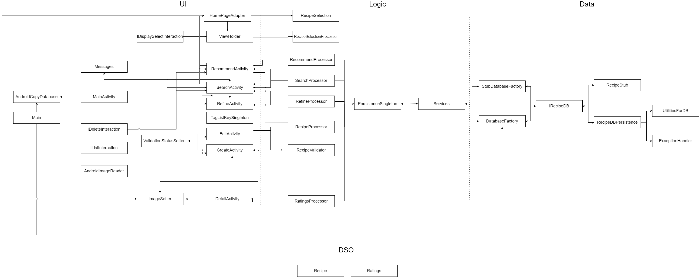

# Architecture

## UI Layer

### MainActivity
MainActivity will connect all the activities and widgets and leads users to SearchActivity by default.

### Messages
Messages handles displaying system-level exceptions and error messages.

### CreateActivity
CreateActivity will be the screen the user will be taken to when adding a new recipe, with boxes for inputting a name, description, ingredients and tags.

### SearchActivity
SearchActivity is the screen within which the user will be able to search for recipes and view a list of recipes relevant to their query.

### DetailActivity
DetailActivity is the screen users can view individual recipe details such as name, description, ingredients and tags.

### RecommendActivity
RecommendActivity is the screen which users will be too see recipes based on the ingredients they chose to query. (works similar to SearchActivity)

### HomePageAdapter
Updates and displays the list of recipes on the home page.

### ImageSetter
Implements a simplified test, ensuring images are retrieved.

### ValidationStatusSetter
Is passed between the UI and RecipeValidator to create error messages that are displayed.

### ViewHolder
Passed between HomePageAdapter and SearchActivity, allows the user to interact with the list the of recipes, like deleting

### TagListKeySingleton
TagListKeySingleton provides a single point of access for our list of tags that the user can filter on.

## AndroidCopyDatabase
A high coupled class that copies the database to the device

## AndroidImageReader
A high coupled class that adds a selected image to a device's local file

## IDeleteInteraction
An interface that implements Delete functions such that the Logic layer can interact with the UI Layer

## IDisplaySelectionInteractions
An interface that implements functions used to display the state of a Recipe (whether it is selected or not) such that the Logic Layer can interact with the UI Layer

## IListInteraction
An interface that implements functions used to interact with the list of display, like pressing a recipe, such that the Logic layer can interact with the UI Layer

## Logic Layer

### RecipeProcessor 
RecipeProcessor will handle the logic of interacting with the database 

### PersistenceSingleton
PersistenceSingleton provides a single point of access for our database.

### SearchProcessor
SearchProcessor will be the class for handling the logic and returning the results of querying through the collection(stub/database) of recipes.

### RecipeValidator
A validator class that takes in Recipe parameters and ensures that they constitute a valid instance of a class. Sends error messages back to the UI when needed.

### RefineProcessor
Handles filtering recipes using our list of tags and displaying them in RefineActivity.

### RecipeSelectionProcessor
Handles the logic of whether a recipe was selected or not

### RecipeSelectionInteraction
Handles the logic of the interactions of recipes that are selected or not

### Services
Acts as a middleman between the logic and DB layer, handling queries to the SQL database.

## Data Layer
### IRecipeDb
IRecipeDb is the class that handles the storage of recipes within a database.

### RecipeStub
Our stub database used for testing.

### RecipeHSQLDB
The class that allows access to and handles our recipe database.

### ExceptionHandler
Used to handle any exceptions that arises from use of the SQL database.

### UtilitiesForDB
Provides utilities for the HSQLDatabase 

### Main
Main is a helper class that contains information about the database

## DSOs
### Recipe
Recipe will be our main object that will be passed through the three layers. This object will be populated with all of the details of a specific recipe.

### Ratings
Ratings contains information of a Recipe's ratings that will be passed through the three layers

