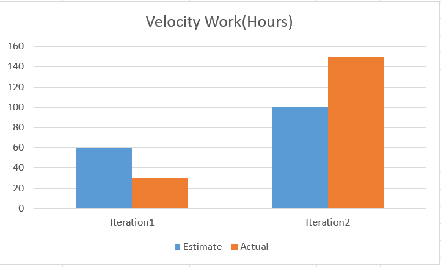

A part of the project that was not as successful as we would have liked was the file structure. The 5 folders, while categorized, was not sufficient enough in informing the contextual usage of each file. As an example, the logic part contained singletons that contained constant values used throughout the project. This is different from the common assumption that the logic folder should be filled with evaluations and not constant values, although they are the appropriate placement. Thus, we would like to redo the strucutre for this remaining iteration to make working with the project easier. Two concrete and realistic ways of improvement can be coordinate of task timelines and assistance in other unassigned tasks. This can be measured by seeing pre requisite tasks accomplished in a timely manner as well as seeing specific tasks be assigned to specific members. 

